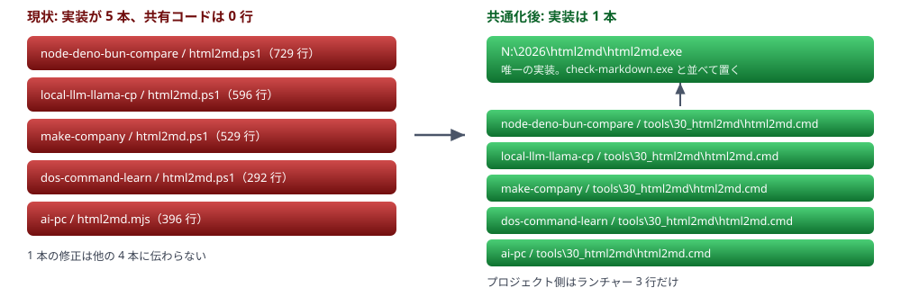

# html2md ツール共通化計画

5 プロジェクトに散在する HTML→Markdown 変換スクリプトを、`N:\2026\html2md` の共通ツールに統合する。あわせて PowerShell スクリプトを `csc.exe` でビルドする C# の exe に置き換える。

> 📅 作成: 2026-08-28 / 更新: 2026-08-29

[← html2md](../../README.md) ／ [HTML クラス名の取り決め](../90_rules/html-class-rules.md)

## 目次

1. [いまどうなっているか](#1-いまどうなっているか)
2. [5 本の実装を突き合わせる](#2-5-本の実装を突き合わせる)
3. [共通化の形](#3-共通化の形)
4. [exe にする理由と作り方](#4-exe-にする理由と作り方)
5. [日本語の強調が壊れる問題](#5-日本語の強調が壊れる問題)
6. [生成後の検査](#6-生成後の検査)
7. [進め方](#7-進め方)
8. [決めたこと](#8-決めたこと)

## 1. いまどうなっているか

`~/.claude/CLAUDE.md` の「HTML→Markdown 変換ルール」は、以前は変換スクリプトを各プロジェクトの `src/scripts/70_html2md/` に置くことにしていた。この決まりに従った結果、同じ目的のスクリプトが 5 プロジェクトにそれぞれ書かれた。

| プロジェクト | 実装 | 行数 | 変換対象の決め方 |
|---|---|---:|---|
| 20260824-node-deno-bun-compare | html2md.ps1 | 729 | 自動探索（README + docs 配下） |
| 20260824-local-llm-llama-cp | html2md.ps1 | 596 | スクリプト内に 5 件ハードコード |
| 20260826-make-company | html2md.ps1 | 529 | 自動探索（`-Root` 引数あり） |
| 20260824-dos-command-learn | html2md.ps1 | 292 | ルート配下の全 html を再帰 |
| 20260824-ai-pc | html2md.mjs | 396 | スクリプト内に 5 件ハードコード |
| 20260828-typescript-learn | （空） | 0 | フォルダだけ存在する |

5 本は独立に書かれており、共有しているコードは 1 行も無い。関数名も設計も別で、たとえばブロックの切り出しは `Get-BlockEnd`・`Get-TagBlock`・巨大な 1 本の正規表現・`String.replace` の連鎖と、4 通りの方法が使われている。

### 何が困るか

- 1 本で見つけた不具合が、他の 4 本に伝わらない。
- 1 本にしかない機能が、他の 4 本では使えない。表の `rowspan` 展開は `local-llm-llama-cp` 版だけ、`md-skip` は `node-deno-bun-compare` 版だけにある。
- 新しいプロジェクトを作るたび、6 本目を書くことになる。

## 2. 5 本の実装を突き合わせる

共通版に何を入れるかを決めるため、5 本が実際に何をしているかを機能単位で並べた。✅ **実装あり** ❌ **実装なし**

| 機能 | node-deno | local-llm | make-company | dos-cmd | ai-pc |
|---|---|---|---|---|---|
| 変換対象の自動探索 | ✅ | ❌ | ✅ | ✅ | ❌ |
| 入れ子に対応したブロック切り出し | ✅ | ❌ | ✅ | ❌ | ❌ |
| ブロックの再帰処理 | ❌ | ❌ | ✅ | ❌ | ❌ |
| `md-skip` による出力除外 | ✅ | ❌ | ❌ | ❌ | ❌ |
| 目次のアンカー張り替え | ✅ | ✅ | ✅ | ❌ | ✅ |
| callout の種別をクラスで指定 | ✅ | ❌ | ✅ | ❌ | ❌ |
| 表の `rowspan` / `colspan` 展開 | ❌ | ✅ | ❌ | ❌ | ❌ |
| セル内の `|` エスケープ | ❌ | ✅ | ✅ | ✅ | ✅ |
| コードフェンスの言語指定 | ✅ | ❌ | ❌ | ❌ | ❌ |
| SVG の内部 id 振り直し | ❌ | ❌ | ✅ | ❌ | ❌ |
| `figure` / `figcaption` | ❌ | ❌ | ✅ | ❌ | ❌ |
| `img` タグ | ❌ | ❌ | ❌ | ❌ | ✅ |
| ミニタイトルバー | ❌ | ✅ | ❌ | ✅ | ❌ |
| 入れ子リスト | ❌ | ❌ | ❌ | ❌ | ❌ |
| 検査: Markdown 側のリンク切れ | ✅ | ✅ | ✅ | ❌ | ✅ |
| 検査: アンカー先の実在 | ❌ | ❌ | ✅ | ❌ | ❌ |
| 検査: HTML が `.md` を参照 | ✅ | ❌ | ✅ | ❌ | ✅ |
| 検査: HTML 側のリンク切れ | ✅ | ❌ | ❌ | ❌ | ❌ |
| 検査: Markdown 側だけの文言 | ✅ | ✅ | ✅ | ❌ | ✅ |
| 検査: 更新日の書き換え忘れ | ❌ | ✅ | ❌ | ❌ | ❌ |
| 書き出さずに確認する `--dry-run` | ✅ | ❌ | ❌ | ❌ | ❌ |
| **日本語の強調が壊れるのを避ける** | ❌ | ❌ | ❌ | ❌ | ❌ |

最後の行が 5 本とも ❌ **実装なし** だった。`~/.claude/CLAUDE.md` は「判定は変換スクリプト側で機械的に行う。書き手に意識させない」と決めているが、実際にはどの版も `<strong>` を無条件に `**` へ置き換えている。壊れた箇所は `check-markdown.ps1` で後から見つけて手で直す運用になっていた。これは第 5 章で扱う。

共通版に入れる機能は、この表の **合併集合**とする。同じ機能が複数の版にある場合は、より正確な実装を採る。ブロック切り出しは `<p>` と `<pre>` を取り違えないタグ名の境界チェックがある `make-company` 版、表は `rowspan` を展開する `local-llm` 版、といった選び方になる。入れ子リストはどの版にも無いが、基本機能として加える。

## 3. 共通化の形

実装は `N:\2026\html2md` に 1 本だけ置き、各プロジェクトにはそれを呼ぶランチャーだけを置く。`check-markdown.ps1` をプロジェクトを問わず 1 箇所に置いているのと同じ扱いにする。



### プロジェクト側に置くもの

ランチャーは共有実装にプロジェクトフォルダを渡すだけにする。置き場所は `tools/30_html2md/` になる（納品しないものは `tools/` に置く決まりのため）。このフォルダの `html2md.cmd` をダブルクリックする使い方は従来どおり。

```
@echo off
rem 共通の html2md を、このプロジェクトを対象に呼ぶ
"N:\2026\html2md\html2md.exe" --root "%~dp0..\..\.."
pause
```

### この形の代償

| 項目 | 内容 |
|---|---|
| 得るもの | 修正が全プロジェクトに即座に反映される。実装が 1 本になるので、機能を足す場所も直す場所も 1 箇所で済む |
| 失うもの | `N:` ドライブに依存する。プロジェクトを git clone しただけでは変換できない。ランチャーは git 管理下に入るが、実体は入らない |
| 判断 | これらの HTML ドキュメントは手元で書いて手元で Markdown 化するもので、clone 先で変換をやり直す場面が無い。ドライブ依存は受け入れる |

## 4. exe にする理由と作り方

共通実装は PowerShell スクリプトではなく、`csc.exe` でビルドする C# の exe にする。`check-markdown.ps1` も同じく exe に置き換える。

### なぜ exe か

- 起動が速い。PowerShell はプロセス起動とプロファイル読み込みに時間がかかり、正規表現も実行ごとに解釈される。ドキュメント 5 本の変換を何度も回す作業では、この差がそのまま待ち時間になる。
- PowerShell のバージョン差を気にしなくなる。現状の `node-deno` 版は `ScriptBlock` をデリゲートに変換するため `#Requires -Version 6.0` が付いており、Windows 標準の 5.1 では動かない。
- 文字コードの事故が減る。BOM の有無で 5.1 の日本語が壊れる、といった制約から離れられる。

### どの csc.exe を使うか

この PC には 3 通りある。

| 候補 | C# の版 | 前提 | 採否 |
|---|---|---|---|
| `C:\Windows\Microsoft.NET\Framework64\v4.0.30319\csc.exe` | C# 5 相当 | Windows に標準搭載。追加インストール不要 | ✅ **採用** |
| VS 2022 Community 同梱の Roslyn `csc.exe` | 最新 | Visual Studio が入っている環境だけ | ⚠ **あれば優先** |
| dotnet SDK 7.0.202（`dotnet build`） | 最新 | SDK が必要。単一 exe にするには publish 手順が要る | **使わない** |

基準は「Windows さえあればビルドできる」こと。標準搭載の `csc.exe` で通るコードなら、どの環境でも同じ手順で作り直せる。C# 5 相当なので文字列補間（`$"..."`）や `out var` は使えないが、正規表現・ジェネリクス・LINQ は揃っており、この用途では困らない。

ビルドスクリプトは Roslyn 版があればそれを、無ければ標準搭載版を選ぶ。どちらでビルドしても同じ動作になるよう、コードは C# 5 の範囲で書く。

### 置くもの

| ファイル | 役割 |
|---|---|
| `src\Html2Md\*.cs` | 変換と検査の実装 |
| `src\CheckMarkdown\*.cs` | GitHub の Markdown API で表示を確かめる実装 |
| `build.cmd` | `csc.exe` を探して 2 本の exe をビルドする |
| `html2md.exe` / `check-markdown.exe` | ビルド成果物。各プロジェクトのランチャーが呼ぶ |

## 5. 日本語の強調が壊れる問題

CommonMark は `**` の前後にある文字を見て、それが開き記号として使えるか・閉じ記号として使えるかを判定する。日本語では判定に落ちる並びが頻繁に現れ、`**` が記号のまま表示される。


### 判定の規則

`**` は語中にも置けるため、開閉が成立しないのは次の 2 つの場合だけになる。

| 側 | 成立しない条件 | 踏んだ文字 |
|---|---|---|
| 開き | 強調する内容の先頭が句読点で、`**` の手前が通常文字（空白でも句読点でもない） | `「` `［` `.` `-` `@` |
| 閉じ | 強調する内容の末尾が句読点で、`**` の直後が通常文字 | `。` `」` `）` `］` |

ここでいう句読点は Unicode の P 系カテゴリと S 系カテゴリで、`✅` や `⚠` のような記号も含まれる。バッジを `**✅ 良い**` の形で出している既存の版は、この規則にそのまま該当する。第 8 章でバッジの記号を太字の外に出すと決めたのは、この並びを作らないためでもある。

### 実装の方法

変換の途中では記法を決められない。`**` が成立するかは前後の文字で決まり、その文字は他の要素の変換が終わるまで確定しないためだ。そこで次の順序にする。

1. `<strong>` と `<em>` は、いったん本文に現れない制御文字（センチネル）で囲んでおく。
2. ブロックを組み立て、コードスパンを戻して本文を完成させる。
3. センチネルを内側から順に見て、その位置の前後の文字で判定し、`**` かタグかを確定させる。

内側から処理するのは、入れ子の強調では内側の記号が外側の判定材料になるため。`**` で足りる箇所は `**` のままにして、タグは必要な箇所だけに留める。

> [!NOTE]
> <strong>この規則は既存の Markdown にも当てはまる。</strong>すでに生成済みの Markdown には、手で `<strong>` に直した箇所と、まだ壊れたままの箇所が混ざっている。共通版で作り直せば機械的に揃うが、そのとき既存ファイルの差分は大きくなる。

## 6. 生成後の検査

変換のあとに機械的な検査を行う。5 本にあった検査をすべて入れる。

| 検査 | 見るもの | 扱い |
|---|---|---|
| Markdown 側のリンク切れ | 相対リンクの参照先が実在するか | ❌ **指摘** |
| アンカー切れ | `#...` のリンク先が、生成した見出しに存在するか | ❌ **指摘** |
| HTML が `.md` を参照 | HTML 側のリンクに `.md` が書かれていないか | ❌ **指摘** |
| HTML 側のリンク切れ | HTML 側の相対リンクの参照先が実在するか | ❌ **指摘** |
| Markdown 側だけの文言 | HTML の可視テキストに無い文字列が Markdown に現れていないか | ❌ **指摘** |
| 更新日の書き換え忘れ | ヘッダの更新日が、ファイルの最終更新時刻より古くないか | ⚠ **警告** |

更新日だけを警告に留めるのは、体裁だけの変更では更新日を変えない決まりがあり、古いことが正しい場合があるため。指摘は 1 件でもあれば終了コード 1 を返す。

> [!WARNING]
> <strong>リンクとクラス名の検査は、コードブロックとコードスパンの中を除く。</strong>HTML の書き方を説明する文書では、`<pre>` や `<code>` の中にコード例としてリンクやクラス名が現れる。タグを実体参照でエスケープしても属性の中身は生のままなので、素朴に拾うと存在しないファイルへのリンクや、書き換え漏れのクラス名として誤検出する。この計画とクラス名の取り決めを書いている最中に、どちらも実際に踏んだ。`<pre>` だけを除いても足りない。

### check-markdown との役割分担

`html2md` の検査はローカルのファイルだけを見る。GitHub 上で実際にどう表示されるかは `check-markdown` が Markdown API に投げて確かめる。第 5 章の判定を入れれば `**` の破綻は出なくなる見込みだが、**見込みで済ませずに実物で確認する**という役割は残す。

| 終了コード | 意味 |
|---:|---|
| 0 | 問題なし |
| 1 | 表示が壊れる箇所がある |
| 2 | 検証できなかった（レート制限・通信断など）。「問題なし」ではない |

## 7. 進め方

一度に全部を差し替えず、出力を比べながら段階的に移す。

| 段階 | やること | 確認方法 |
|---|---|---|
| 1 | クラス名の取り決めを固める | [HTML クラス名の取り決め](../90_rules/html-class-rules.md)に書いた |
| 2 | `html2md` を C# で実装する（変換＋ローカル検査） | `build.cmd` が通ること |
| 3 | 既存 5 プロジェクトを `--dry-run` で変換し、現行 ps1 の出力と差分を取る | 差分が「意図した改善」だけになるまで直す |
| 4 | 各プロジェクトの HTML のクラス名を取り決めに合わせる | 1 プロジェクトずつ、見た目を確かめてから次に移る |
| 5 | 各プロジェクトの `tools/30_html2md` にランチャーを置き、旧 `src/scripts/70_html2md` の ps1 / mjs を退避する | ダブルクリックで従来どおり動くこと |
| 6 | 生成した Markdown を `check-markdown` にかける | `**` の残りが 0 件になること |
| 7 | `check-markdown` を C# に移す | ps1 版と同じ判定結果になること |
| 8 | 旧 ps1 / mjs を削除する | 削除対象を提示して確認を取ってから実施 |

段階 3 が要になる。5 本はそれぞれ別の HTML を相手にしてきたので、共通版が同じ HTML から同じ内容を出せるかは実際に流してみないと分からない。差分が出た箇所は、共通版の不足か、旧版の不具合か、意図した仕様変更かを 1 件ずつ判断する。

> [!NOTE]
> <strong>段階 5 で旧版をすぐ削除しない。</strong>退避して残しておけば、出力が変わったときに旧版と突き合わせられる。削除は段階 8 まで待つ。

## 8. 決めたこと

保留していた 5 件を確定させた。いずれも「プロジェクトごとに分岐させない」方向で揃えている。差分を吸収する仕組みを作るのではなく、差分そのものを無くす。

| 論点 | 決定 | 理由・補足 |
|---|---|---|
| プロジェクト固有の差分（バッジのクラス名・callout の種別クラス） | 既定のクラス名に統一する。設定ファイルは持たない | クラス名がプロジェクトごとに違うこと自体をやめる。命名は[別文書](../90_rules/html-class-rules.md)にルールとして残した |
| バッジの出力形式 | 記号を太字の外に出す（`✅ **良い**`） | 共通ルールとして固定する。強調の内側に記号が入らないので、第 5 章の判定に該当する箇所も減る |
| 段落内の `<br>` | `<br>` タグをそのまま出す | 表のセル内はすでにこの形で、表の中と外で表現が一致する。行末 2 空白は CommonMark の標準記法だが、trailing space はエディタや `.editorconfig` で落ちるうえ差分にも現れない |
| ビルド成果物の exe を git に含めるか | 含めない | ビルド後にサイズを測り、小さければ含める方向で再検討する |
| 変換対象の探索範囲 | `README.html` と `notes\` 配下を既定とし、探索するフォルダを引数で渡せるようにする | 既存プロジェクトはまだ `docs\` を使っているため、フォルダ名を実装に埋め込まない |

### クラス名を統一する意味

設定ファイルで差分を吸収する案は採らなかった。設定を用意すると、プロジェクトごとに違う状態が固定される。`~/.claude/CLAUDE.md` の HTML デザインルールはすでに配色・見出し・バッジの構造を 1 つに決めており、クラス名だけが揃っていないのは、書いた時期がばらばらだったからにすぎない。

名前の取り決めは[別文書](../90_rules/html-class-rules.md)に分けた。統一先は 6 プロジェクト 26 ファイルの集計で採用数の多いほうを選んでいるので、書き換えは最少で済む。`~/.claude/CLAUDE.md` には、この別文書を参照する 1 行を入れた。

### 引数の形

探索するフォルダを外から渡せるようにする。既定は CLAUDE.md のルールどおり `README.html` と `notes\` 配下。

```
html2md.exe [オプション]

  --root <パス>     対象のプロジェクトフォルダ（既定: カレントフォルダ）
  --dir <名前>      探索するフォルダ。複数回指定できる（既定: notes）
  --no-readme       ルート直下の README.html を対象から外す
  --dry-run         書き出さず、変換結果と検査結果だけを表示する
```

まだ `docs\` を使っているプロジェクトでは、ランチャー側で `--dir docs` を渡す。実装を触らずに済む。

### この計画に入っていないもの

- Markdown から HTML への逆変換。HTML を正とする方針が変わらない限り必要ない。
- `20260828-typescript-learn` の空フォルダの扱い。ランチャーを置けばそのまま使えるようになる。

[← html2md](../../README.md)
