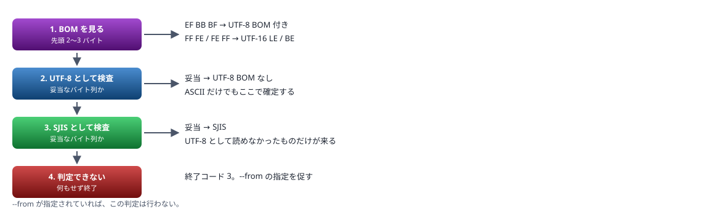

# convert-encoding 仕様書

文字コードと改行を変換するコマンドライン ツール

> 📅 作成: 2026-09-06 / 更新: 2026-09-10

[← html2md](../../README.md) ／ [課題](../40_issues/issues.html)

1. [目的と背景](#1-目的と背景)
2. [コマンドライン](#2-コマンドライン)
3. [文字コードの判定](#3-文字コードの判定)
4. [変換の手順](#4-変換の手順)
5. [出力と終了コード](#5-出力と終了コード)
6. [テストケース](#6-テストケース)
7. [ビルドと配置](#7-ビルドと配置)
8. [文字コードの知識](#8-文字コードの知識)

## 1. 目的と背景

### 何のためのツールか

ファイルの文字コードと改行コードを、決められた組み合わせへ変換する。Windows で扱うスクリプトは種類ごとに求められる形式が違うが、それを毎回手で書き分けている。

| ファイル | 求められる形式 |
|---|---|
| ps1 | BOM 付き UTF-8 ＋ CRLF |
| cmd・bat | SJIS（CP932）＋ CRLF |
| html・md・その他 | BOM なし UTF-8 ＋ LF |

### いま何が起きているか

AI エージェントがファイルを書くとき、書き込みツールは **BOM なし UTF-8 ＋ LF** でしか書けない。そのため書いたあとに PowerShell で変換している。この変換の書き方を、セッションごとに毎回組み立て直している。

> [!NOTE]
> **1 つのセッションで書き方が 3 回変わった。**`WriteAllBytes` を使い、Defender に `Trojan:Win32/FileFix` として検知されて止まり、`Set-Content` に変え、改行の置換を 2 回から 1 回に直した。次のセッションはまた同じ道を辿る。

### ツールにすると何が変わるか

| 観点 | いま | ツール化後 |
|---|---|---|
| 手法 | セッションごとに組み立てる | 引数を渡すだけ。判断の余地が無い |
| ウイルス対策 | コマンド文字列が AMSI にスキャンされる。書き方によって検知される | exe の内部処理はスキャンされない |
| 速度 | PowerShell の起動に 350〜440 ms | ネイティブ exe で 17 ms（実測） |
| 正しさ | 変換のたびに書き間違いの余地がある | テストで担保できる |

速度は決め手ではない。**手法が固定されることと、AMSI に触れないことが本題**にあたる。

### 置き場

このプロジェクトに置く。`check-contrast`・`check-markdown`・`html2md` と同じく、プロジェクトを問わず使う共通ツールとして扱う。

> [!NOTE]
> <strong>この仕様書は `20260905-windows-pc-memory-inspection` から受け取った。</strong>2026-09-06 に実装を引き受け、参考実装とあわせてこちらへ写した。文面は取り込み後の状態に合わせて直してある。

## 2. コマンドライン

### 書式

```text
convert-encoding <path> --to <指定>[/<改行>] [--from <形式>] [--force]
convert-encoding <path> --info
convert-encoding <path> --read
convert-encoding <path> --from hex
convert-encoding <path> --dump [--offset <n>] [--bytes <m>]
convert-encoding --help
```

### 引数

| 引数 | 必須 | 内容 |
|---|---|---|
| <path> | はい | 対象ファイル。1 つだけ受ける |
| --to <指定> | はい<br>（--info・--read 時は不要） | 変換先。用途名または文字コード名。`/` の後ろで改行も指定できる |
| --from <形式> | いいえ | 変換元の文字コード。省略すると自動判定 |
| --force | いいえ | 変換先で表現できない文字があっても続行する |
| --info | いいえ | いまの状態を表示するだけ。書き込まない |
| --read | いいえ | 中身を UTF-8 で標準出力へ出す。書き込まない |
| --from hex | いいえ | 中身を 16 進テキストとみなし、バイト列に展開して書き戻す |
| --dump | いいえ | 中身を 16 進テキストで標準出力へ出す。書き込まない |
| --offset <n> | いいえ | --dump の開始位置（バイト）。省略すると先頭から |
| --bytes <m> | いいえ | --dump で出すバイト数。省略すると末尾まで |

### --to の指定

**用途名**と**文字コード名**のどちらでも書ける。`/` の後ろに改行を足すと、それを上書きする。

```text
--to ps1            用途名。文字コードと改行の両方が決まる
--to ps1/lf         用途名 ＋ 改行の上書き
--to sjis           文字コード名。改行は入力のまま変えない
--to sjis/crlf      文字コード ＋ 改行
--to /crlf          改行だけ変える。文字コードは変えない
```

#### 用途名

ファイルの種類で選ぶ。**文字コードと改行の組み合わせを覚えなくて済む。**

| 用途名 | 文字コード | 改行 | 対象 |
|---|---|---|---|
| ps1 | UTF-8 BOM 付き | CRLF | PowerShell スクリプト |
| cmd | SJIS（CP932） | CRLF | コマンド スクリプト |
| bat | SJIS（CP932） | CRLF | 同上 |
| reg | UTF-16 LE ＋ BOM | CRLF | レジストリ ファイル |
| html | UTF-8 BOM 付き | LF | HTML。BOM を付けると、どのブラウザで開いても化けない |

<strong>用途名は 1 箇所の表で定義し、追加できるようにする。</strong>新しい種類が出たときに、その表へ 1 行足すだけで済む形にする。

#### 文字コード名

`--to` と `--from` のどちらにも同じ語を使う。

| 名前 | 内容 |
|---|---|
| utf8 | UTF-8 BOM なし |
| utf8bom | UTF-8 BOM 付き |
| sjis | CP932 |
| utf16le | UTF-16 リトルエンディアン ＋ BOM |
| utf16be | UTF-16 ビッグエンディアン ＋ BOM |

#### 改行

| 名前 | 内容 |
|---|---|
| lf | LF |
| crlf | CRLF |

> [!NOTE]
> **改行を書かなければ、改行は変えない。**「指定しなかったものは変えない」で通す。文字コードごとに既定の改行を決めると、その対応を覚える必要が生じ、覚え違いが事故になる。用途名だけは例外で、種類ごとに改行まで決まる。

### --from の指定

**文字コード名だけ**を書く。読むときに改行を区別する必要はないため、`/` を付けたらエラーにする。

用途名も受け付ける（`--from cmd` は `sjis` と同じ）。`--to` と同じ語彙で書けるようにするため。

> [!NOTE]
> <strong>--from は逃げ道として用意する。</strong>自動判定に任せきりだと、判定を誤ったときに手の打ちようがなくなる。純 ASCII のファイルは UTF-8 とも SJIS とも解釈できるため、判定が割れる場面は必ず残る。

### 使用例

```text
convert-encoding tools/80_ops/foo.ps1 --to ps1
convert-encoding tools/80_ops/foo.cmd --to cmd
convert-encoding etc/setup.reg         --to reg
convert-encoding notes/memo.html       --to utf8/lf
convert-encoding foo.txt               --to /crlf
convert-encoding legacy.txt            --to utf8 --from sjis
convert-encoding foo.cmd               --info
convert-encoding foo.cmd               --read
```

### --from hex で 16 進テキストを展開する

ファイルの中身を 16 進テキストとして読み、<strong>バイト列に展開して書き戻す。</strong>テストデータを作るために用意した。

```powershell
# tmp/case.txt の中身が「41 80 42」というテキスト
convert-encoding tmp/case.txt --from hex
# → 中身が 3 バイト（0x41 0x80 0x42）になる
```

> [!IMPORTANT]
> <strong>PowerShell でバイト列を書くと、ウイルス対策に検知される。</strong>2026-09-06 に `Trojan:PowerShell/AmsiBypazz.D!MTB` として実際に止められた。バイト配列を組み立ててファイルへ書く形が、シェルコードを書き込むパターンとして拾われる。<strong>AMSI が見るのはスクリプトで、exe の内部処理は対象外。</strong>16 進テキストは ASCII だけなので、書き込みツールで安全に作れる。

| 項目 | 内容 |
|---|---|
| 受け付ける形 | `41 80 42` ／ `418042` ／ 改行区切り。空白と改行は無視する |
| 大文字小文字 | どちらも受ける |
| 桁数が奇数 | 終了コード 1 |
| 16 進以外の文字 | 終了コード 1。位置を示す |
| `--to` との併用 | 終了コード 1。展開だけを行う |
| 書き込み | 一時ファイルを経由する。変換と同じ |

> [!NOTE]
> <strong>入力そのものは判定しない。</strong>16 進テキストは ASCII なので、文字コードの判定を通す意味が無い。展開した結果が妥当なバイト列である必要も無い（**判定できないバイト列を作るのが用途のため**）。

### --dump でバイト列を 16 進で見る

`--from hex` の逆。<strong>中身を 16 進テキストで標準出力へ出す。</strong>ファイルは書き換えない。文字コードを判定できないファイルや、化けて見えるファイルの中身を、バイト単位で確かめるために使う。

```text
convert-encoding foo.cmd --dump
40 65 63 68 6F 20 6F 66 66 0D 0A 73 65 74 6C 6F
63 61 6C 20 65 6E 61 62 6C 65 64 65 6C 61 79 65
64 65 78 70 61 6E 73 69 6F 6E
```

| 項目 | 内容 |
|---|---|
| 出力の形 | 2 桁の 16 進を空白区切り。大文字。<strong>16 バイトごとに改行。</strong>末尾にも改行 1 つ |
| 1 行の幅 | 16 バイト × 2 桁 ＋ 空白 15 個 ＝ <strong>47 文字。</strong>右に文字を併記しても 80 桁に収まる |
| --offset | 開始位置（バイト）。省略すると 0 |
| --bytes | 出すバイト数。省略すると末尾まで |
| 範囲がファイルを超える | ある分だけ出す。エラーにしない |
| offset がファイルを超える | 何も出さない。終了コード 0 |

> [!NOTE]
> <strong>16 バイトごとに改行する。</strong>人が目で追いやすいように折り返す。16 バイトは hexdump などの慣例。**出力はそのまま `--from hex` へ渡せる**——展開は空白も改行も読み飛ばすため、折り返しがあっても元のバイト列に戻る。

#### 将来機能

> [!IMPORTANT]
> <strong>まだ実装しない。</strong>次の 2 つは要望として記録しておく。

- **`--format` で番地と文字を併記する。**`0000: 40 65 63 … @ec…` のように、行頭にオフセット（16 進）、右に文字を出す。hexdump の形。文字コードは `--from` で指定するか判定に従う。**2 バイト文字が 16 バイトの境界で割れる扱いを決める必要がある**

### --read で読む

中身を UTF-8 で標準出力へ出す。**ファイルは書き換えない。**

> [!IMPORTANT]
> <strong>読み取りツールは SJIS のファイルを UTF-8 として読むため化ける。</strong>文字コードを指定する手段が無く、化けたまま推測で扱うことになる。`--read` はその逃げ道として用意した。

変換元の判定は `--to` と同じ。`--from` も効く。判定できなければ終了コード 3 で、何も出さずに終える。

> [!WARNING]
> <strong>受け取る側の文字コードを固定する。</strong>Windows PowerShell 5.1 は外部コマンドの出力を OEM コードページ（932）として読むため、UTF-8 のバイト列が化ける。スクリプトから使うときは `[Console]::OutputEncoding` を UTF-8 にしておく。pwsh 7 は既定で UTF-8 のため、そのままで読める。

## 3. 文字コードの判定

### 判定の順序

`--from` が指定されていればそれに従い、判定しない。省略されたときだけ調べる。**片方を先に試して確定させるのではなく、両方を検査してから決める。**



| UTF-8 として | SJIS として | 決まる文字コード |
|---|---|---|
| 妥当 | 不正 | UTF-8 |
| 不正 | 妥当 | SJIS |
| 妥当 | 妥当 | **純 ASCII なら UTF-8。それ以外は判定できない** |
| 不正 | 不正 | 判定できない |

### UTF-8 として妥当かの検査

バイト列を先頭からたどり、UTF-8 の並びとして成立するかを見る。

| 先頭バイト | 続くバイト | 表す範囲 |
|---|---:|---|
| 0x00〜0x7F | 0 | ASCII |
| 0xC2〜0xDF | 1 | U+0080〜U+07FF |
| 0xE0〜0xEF | 2 | U+0800〜U+FFFF |
| 0xF0〜0xF4 | 3 | U+10000〜U+10FFFF |

続くバイトは `0x80〜0xBF` の範囲でなければならない。**0xC0・0xC1・0xF5〜0xFF は UTF-8 に現れない**ので、見つかった時点で UTF-8 ではない。

> [!NOTE]
> **過剰な長さの符号化（overlong encoding）は弾く。**`C0 80` のように、短く書けるものを長く書いた並びは不正とする。ここを通すと UTF-8 として妥当と見なす範囲が広がり、<strong>両方とも妥当になって止まるファイルが増える。</strong>実際 `E0 80 81 41`（SJIS では「烙、」）はこの判定で弾かれ、SJIS に決まる。

### SJIS として妥当かの検査

| 先頭バイト | 続くバイト | 内容 |
|---|---:|---|
| 0x00〜0x7F | 0 | ASCII |
| 0xA1〜0xDF | 0 | 半角カナ |
| 0x81〜0x9F, 0xE0〜0xFC | 1 | 2 バイト文字 |

2 バイト目は `0x40〜0x7E` または `0x80〜0xFC`。

### 判定できない場合

<strong>何も書き込まずに終了する。</strong>推測で変換すると、失敗したときに元へ戻せない。`--from` を指定するよう促すメッセージを出す。

#### 純 ASCII のファイル

ASCII だけのファイルは UTF-8 とも SJIS とも解釈できる。<strong>UTF-8 と判定する。</strong>どちらに解釈しても変換結果のバイト列は同じになるため、実害は無い。

#### 両方とも妥当になる並び

非 ASCII を含みながら、UTF-8 としても SJIS としても成立するバイト列がある。**半角カタカナがそれにあたる。**

| バイト列 | UTF-8 として | SJIS として |
|---|---|---|
| `C2 B1` | 「±」 U+00B1（1 文字） | 「ﾂｱ」 U+FF82 U+FF71（2 文字） |

SJIS の半角カタカナは `0xA1`〜`0xDF` の 1 バイトで、この範囲が**UTF-8 の続きバイト（`0x80`〜`0xBF`）と 2 バイト文字の先頭（`0xC2`〜`0xDF`）にそのまま重なる。**「ﾂ」〜「ﾝ」の直後に「｡」〜「ｿ」が来る並びは、UTF-8 の 2 バイト文字として完全に妥当になる。

> [!CAUTION]
> <strong>先に UTF-8 を試して確定させる作りだと、ここで半角カタカナが失われる。</strong>変換したあとでは元に戻せない。**両方とも妥当なら止める**のはこのため。

#### 実際には、ほとんど止まらない

このプロジェクトの 59 ファイル（cs・ps1・cmd・html・md・svg）で数えたところ、**両方とも妥当になったものは 0 件だった。**

| 分類 | 件数 |
|---|---:|
| 純 ASCII（どちらに読んでも同じ） | 5 |
| UTF-8 だけ妥当 | 51 |
| SJIS だけ妥当 | 3 |
| **両方とも妥当** | **0** |
| どちらでもない | 0 |

> [!IMPORTANT]
> <strong>「漢字が 1 文字あれば決まる」ではない。</strong>UTF-8 の漢字（3 バイト）は、並びと偶奇が揃うと SJIS の 2 バイト文字として構造上妥当になる。`東京都渋谷区` や `1 行目` のような<strong>短い文は両方妥当になり、止まる。</strong>効くのは**長さ**で、1 文字でも SJIS 構造が崩れれば UTF-8 に確定するため、文が長いほど崩れる箇所が必ず現れる。

乱数で作った日本語文で両方妥当率を測ると、<strong>1 文字で 46 %、16 文字で 20 %、64 文字で 1 %、128 文字で 0 %</strong>と、長さに対して急速に下がる。ひらがなが混じる普通の文なら 20 文字ほどで一意に決まる（ひらがなは SJIS 構造を崩しやすい）。実ファイル 59 件が 0 件だったのは、どれも十分な長さがあったため。

検査は先頭から走査し、不正なバイトを見つけた時点で打ち切る。**最後まで読み切るのは「全部妥当だった」場合だけ。**

> [!WARNING]
> <strong>テストデータを短い漢字だけの文にすると、この判定に引っかかって止まる。</strong>テストの本文は数十文字のひらがな混じりの日本語にする。`1 行目` のような短い作為的な文字列は、両方妥当になって判定の段階で終了コード 3 になる。

## 4. 変換の手順

### 順序

1. ファイルをバイト列として読む
2. 文字コードを決める（`--from` または自動判定）
3. 文字列へデコードする。BOM があれば取り除く
4. **変換先で表現できない文字が無いか調べる**
5. 改行を揃える（**指定が無ければ何もしない**）
6. **いまの内容と一致するなら書き込まずに終える**
7. エンコードして書き込む

### 文字コードが変わらないときは、デコードを通さない

変換先の文字コードが変換元と同じなら（`--to /crlf` のように改行だけ変える、あるいは `--to sjis` で元も SJIS など）、**デコードとエンコードを通さず、バイト列のまま改行だけ置き換える。**

> [!CAUTION]
> <strong>CP932 には同じ文字が 2 か所にある重複が 550 件ある。</strong>デコードして再エンコードすると、`ⅰ`（NEC選定 `EEEF`／IBM `FA40`）のような文字が別のバイト列に化ける。<strong>改行だけ変えたつもりでも中身のバイトが変わり、往復が保たれない。</strong>デコードを通さなければこれが起きない。

Shift_JIS の 2 バイト目は `40`〜`FC` で、<strong>改行コード（`0A` / `0D`）は絶対に現れない。</strong>UTF-8 も同じで、続きバイトは `80`〜`BF` だから `0A` / `0D` が文字の途中に現れない。**この 2 つはバイト列のまま改行を探して置き換えても、文字を壊さない。**

| 変換 | 扱い |
|---|---|
| 文字コードが変わる（`--to utf8` で元は SJIS 等） | デコードして移す |
| 同じ文字コード（UTF-8・SJIS）で改行を変える | **バイト列のまま改行を置換** |
| 同じ文字コードで改行も変えない | 変更なしで終える |
| UTF-16 | デコード経路に任せる。**UTF-16 は符号化が一意でバイトが化けない**ため、重複の問題が無い |

> [!NOTE]
> <strong>UTF-16 を対象にしないのは、改行が 2 バイトになりバイト単位の置換が複雑になるため。</strong>符号化に重複が無いので、デコードして再エンコードしてもバイトは保たれる。バイト列のまま置換する利点が無い。

> [!NOTE]
> <strong>表現できない文字の検査も要らない。</strong>文字コードが変わらないなら、失われる文字は最初から無い。

### 改行の変換

改行の指定があるときだけ行う。いったんすべて LF に落としてから、変換先の改行へ置き換える。

```text
CRLF → LF   （\r\n を \n に）
CR   → LF   （残った \r を \n に）
LF   → 目的の改行
```

CR 単独（旧 Mac 形式）もここで拾える。**1 段階で `\r?\n` を置き換える方法だと CR 単独が残る**ため、2 段階にする。

> [!NOTE]
> <strong>改行の指定が無ければ、混在していてもそのまま残す。</strong>勝手に揃えない。文字コードだけ直したいときに、改行まで変わると差分が読めなくなる。揃えたいときは `/lf` か `/crlf` を書く。

### 表現できない文字の扱い

> [!NOTE]
> <strong>SJIS へ変換するとき、文字が失われることがある。</strong>絵文字・ハングル・簡体字・一部の記号は CP932 に存在しない。既定の変換では `?` に置き換わり、元に戻せない。

変換の前に検査し、**表現できない文字があれば何もせず終了する**。`--force` が指定されているときだけ、`?` に置き換えて続行する。

検査は例外を投げる設定でエンコードして確かめる。

```csharp
Encoding strict = Encoding.GetEncoding(
    932,
    EncoderFallback.ExceptionFallback,
    DecoderFallback.ExceptionFallback);

try {
    strict.GetBytes(text);
} catch (EncoderFallbackException ex) {
    // ex.CharUnknown と ex.Index から、失われる文字と位置が分かる
}
```

エラーには**その文字と行番号**を出す。どこを直せばよいか分かるようにする。

### 変更が無いときは書き込まない

変換後のバイト列が元と同じなら、ファイルに触らない。**更新日時が変わると、それを見ている仕組み（ログの圧縮判定など）に影響する**。

何度実行しても結果が同じになる。

### 書き込みの失敗に備える

同じフォルダに一時ファイルを作って書き、成功したら置き換える。書き込みの途中で失敗しても、元のファイルが壊れない。

## 5. 出力と終了コード

### 変換したとき

```text
foo.cmd  SJIS+CRLF -> UTF8BOM+CRLF  1,771 -> 1,802 bytes
```

### 変更が無かったとき

```text
foo.cmd  SJIS+CRLF  変更なし
```

### --info

```text
foo.cmd  SJIS  CRLF=48  LF=0  CR=0  1,771 bytes
```

### --read

中身だけを出す。<strong>ファイル名や件数は付けない。</strong>そのまま別のコマンドへ渡せるようにするため。

### 終了コード

| 値 | 意味 |
|---:|---|
| 0 | 成功（変更なしを含む） |
| 1 | 引数が正しくない |
| 2 | ファイルが無い、または読めない |
| 3 | 文字コードを判定できない |
| 4 | 変換先で表現できない文字がある（--force で回避できる）。または変換元が指定した組として読めない（--from で組を明示） |
| 5 | 書き込みに失敗した |

### メッセージ

日本語で書く。`html2md`・`check-contrast` の出力に合わせる。

```text
[NG] 文字コードを判定できません。--from で指定してください: foo.txt
[NG] SJIS で表現できない文字があります: 3 行目の '✓' (U+2713)
     --force を付けると ? に置き換えて続行します
[NG] ファイルが見つかりません: foo.txt
```

## 6. テストケース

正しさは実測で確かめられる。変換後の先頭バイトと改行の数を見ればよい。

> [!IMPORTANT]
> **受け取った時点では、ケース 3・4 が 2 章の規則と食い違っていた。**「`--to utf8` で LF のみ」を期待していたが、規則は「改行を書かなければ、改行は変えない」と定めている。ケース 5d・5f も規則側を裏付けているため、**ケース 3・4 の記述ミスと判断し、期待値を規則に合わせた。**

### 基本の変換

| # | 入力 | --to | 期待する結果 |
|---:|---|---|---|
| 1 | UTF-8 BOM なし + LF | ps1 | 先頭 EF BB BF、CRLF のみ |
| 2 | UTF-8 BOM なし + LF | cmd | BOM 無し、CP932、CRLF のみ |
| 3 | SJIS + CRLF | utf8 | 先頭が BOM でない。**改行は入力のまま** |
| 4 | UTF-8 BOM 付き + CRLF | utf8 | BOM が消える。**改行は入力のまま** |
| 5 | UTF-16 LE | utf8 | UTF-8 になる、内容が保たれる |
| 5b | UTF-8 + LF | reg | 先頭 FF FE、CRLF のみ、内容が保たれる |
| 5c | 実物の .reg（UTF-16 LE） | reg | 変更なし。regedit で読み込める |

### 指定の解釈

| # | --to の値 | 期待する結果 |
|---:|---|---|
| 5d | sjis | 文字コードだけ変わる。**改行は入力のまま** |
| 5e | sjis/crlf | 文字コードと改行の両方が変わる |
| 5f | /crlf | 改行だけ変わる。**文字コードは入力のまま** |
| 5g | ps1 | utf8bom ＋ CRLF になる |
| 5h | ps1/lf | utf8bom ＋ LF になる（改行を上書き） |
| 5i | 改行が混在した入力に `--to sjis` | **混在したまま**。勝手に揃えない |

### 改行

| # | 入力の改行 | --to | 期待する結果 |
|---:|---|---|---|
| 6 | LF のみ | ps1 | すべて CRLF。CR 単独が 0 |
| 7 | CRLF のみ | ps1 | 変化しない（CRCRLF にならない） |
| 8 | LF と CRLF の混在 | ps1 | すべて CRLF に揃う |
| 9 | CR 単独 | ps1 | CRLF になる |
| 10 | 連続する空行 | ps1 | 行数が変わらない |

### 冪等性と境界

| # | 内容 | 期待する結果 |
|---:|---|---|
| 11 | 同じ変換を 2 回実行する | 2 回目は「変更なし」。更新日時が変わらない |
| 12 | 空のファイル | エラーにしない。BOM だけ付く（--to ps1 のとき） |
| 13 | 末尾に改行が無いファイル | 改行を足さない。元の形を保つ |
| 14 | 純 ASCII のファイル | UTF-8 と判定される。変換結果は正しい |
| 15 | 1 バイトのファイル | 落ちない |

### 失われる文字

| # | 内容 | 期待する結果 |
|---:|---|---|
| 16 | 絵文字を含む UTF-8 を `--to cmd` | 終了コード 4。**ファイルを書き換えない** |
| 17 | 同上に `--force` を付ける | ? に置き換えて変換する。終了コード 0 |
| 18 | SJIS にある文字だけの UTF-8 を `--to cmd` | 成功する（誤検知しない） |

### 判定

| # | 内容 | 期待する結果 |
|---:|---|---|
| 19 | SJIS のファイルを `--info` | SJIS と表示される |
| 20 | 判定できないバイト列 | 終了コード 3。書き込まない |
| 21 | 誤判定するファイルに `--from` を付ける | 指定に従う |
| 22 | 存在しないファイル | 終了コード 2 |
| 23 | UTF-16 LE のファイルを `--info` | utf16le と表示される |
| 24 | `--from utf8bom` を指定して BOM が無い | 続行する。エラーにしない |
| 25 | `--from sjis/crlf` のように改行を書く | 終了コード 1（--from に改行は書けない） |
| 26 | `--to` に知らない名前 | 終了コード 1。使える名前を一覧で出す |

### 16 進テキストの展開

| # | 内容 | 期待する結果 |
|---:|---|---|
| 38 | `41 80 42` を `--from hex` | 3 バイトになる |
| 39 | 空白なしの `418042` | 同じ 3 バイトになる |
| 40 | 改行を挟んだ `4180 42` | 同じ 3 バイトになる |
| 41 | 小文字の `ef bb bf` | BOM の 3 バイトになる |
| 42 | 桁数が奇数の `418` | 終了コード 1。書き込まない |
| 43 | 16 進以外を含む `41 zz 42` | 終了コード 1。位置を示す |
| 44 | `--from hex --to ps1` | 終了コード 1 |
| 45 | 空のファイルを `--from hex` | 0 バイトのまま。エラーにしない |

### 16 進での表示

| # | 内容 | 期待する結果 |
|---:|---|---|
| 46 | 3 バイトのファイルを `--dump` | `41 80 42` が返る。ファイルは変わらない |
| 47 | `--dump --offset 1 --bytes 1` | 2 バイト目だけ返る |
| 48 | `--bytes` がファイルを超える | ある分だけ返る。エラーにしない |
| 49 | `--offset` がファイルを超える | 何も返らない。終了コード 0 |
| 50 | `--dump` の出力を `--from hex` に渡す | 元のバイト列に戻る |
| 51 | 存在しないファイルを `--dump` | 終了コード 2 |

### バイト列を保つ変換

| # | 内容 | 期待する結果 |
|---:|---|---|
| 52 | CP932 の重複文字（`EEEF`）を含む SJIS を `--to /crlf` | <strong>その 2 バイトが `EEEF` のまま。</strong>改行だけ CRLF になる |
| 53 | 同じファイルを `--to sjis/crlf`（文字コードは同じ） | 同上。バイトが化けない |
| 54 | UTF-16 LE のファイルを `--to /crlf` | 改行が CRLF になる。文字は壊れない |

### 両方とも妥当になる並び

| # | 内容 | 期待する結果 |
|---:|---|---|
| 32 | `C2 B1`（SJIS で「ﾂｱ」、UTF-8 で「±」） | **終了コード 3。書き込まない** |
| 33 | 同上に `--from sjis` | SJIS として変換される。半角カタカナが残る |
| 34 | 同上に `--from utf8` | UTF-8 として変換される |
| 35 | 漢字を含む SJIS のファイル | SJIS に決まる。止まらない |
| 36 | 漢字を含む UTF-8 のファイル | UTF-8 に決まる。止まらない |
| 37 | 半角カタカナだけでも `ｱｲｳｴｵ`（`B1 B2 B3 B4 B5`） | SJIS に決まる。先頭バイトが続きバイトの範囲で UTF-8 として不正 |

### 読み取り

| # | 内容 | 期待する結果 |
|---:|---|---|
| 27 | SJIS のファイルを `--read` | 中身が返る。**ファイルを書き換えない** |
| 28 | UTF-16 LE のファイルを `--read` | 中身が返る |
| 29 | BOM 付き UTF-8 を `--read` | BOM が混ざらない |
| 30 | 判定できないバイト列を `--read` | 終了コード 3 |
| 31 | 存在しないファイルを `--read` | 終了コード 2 |

### 実際のファイルでの確認

実ファイルで往復させ、バイト列が元に戻ることを確かめる。このプロジェクトの `build.cmd`（SJIS + CRLF、日本語コメントを含む）と `html2md-ps.ps1`（BOM 付き UTF-8 + CRLF、64 KB）を使う。

## 7. ビルドと配置

### html2md と同じ作りにする

`html2md` は csproj もソリューションも持たず、`build.cmd` が `csc.exe` にソースを直接渡している。同じ形にする。

| 置き場 | 内容 |
|---|---|
| src/ConvertEncoding/*.cs | ソース |
| build-convert-encoding.cmd | ビルド（build.cmd と同じ構造） |
| convert-encoding.exe | 成果物。root 直下 |
| tests/ | テスト |

> [!NOTE]
> <strong>C# 5 の範囲で書く。</strong>Windows 標準の `csc.exe`（.NET Framework 4.8）は C# 5 相当までしか通らない。文字列補間 `$"..."`・`nameof`・null 条件演算子 `?.`・`out var` は使えない。`string.Format` を使う。

### 取り込みの記録

2026-09-06 に取り込んだ。受け取った参考実装は **4 ファイルをそのまま使っている**。C# 5 の範囲で書かれており、直す必要が無かった。

| 置き場 | 内容 |
|---|---|
| src/ConvertEncoding/ | `Program.cs` `Spec.cs` `Detector.cs` `Converter.cs` |
| build-convert-encoding.cmd | `build.cmd` と同じ構造。Roslyn を探し、無ければ Windows 標準の csc を使う |
| convert-encoding.exe | root 直下。15,360 バイト |
| tools/40_test/run-convert-encoding-tests.ps1 | 6 章のケースを実行する。**93 件すべて成功** |

テストの入力は毎回 `tmp/` に作り直すため、何度実行しても同じ結果になる。実ファイル（`build.cmd`・`html2md-ps.ps1`）を UTF-8 ／ LF に落としてから元の形へ戻す往復でも、バイト列が完全に一致した。

> [!NOTE]
> <strong>作ったツールで自分自身を整えた。</strong>テストスクリプトの ps1 と cmd ランチャーの文字コードは、`convert-encoding` を通して決められた形にしてある。

### 共通ルールへの反映

2026-09-06 に反映した。変換手順は `convert-encoding` を呼ぶ形になり、**覚える対象が「用途名だけ」に減った。**

| 見出し | 変わった点 |
|---|---|
| ツールごとの文字コードの扱い | PowerShell のコード片と注意 4 つを差し替え。SJIS の読み方も追加 |
| bat / cmd、ps1 の文字コード・改行コード | 「確認を取らずに直す」の末尾に手段を追記 |
| ブロックされたら回避しない | 自分でバイト列を触らない旨を追加 |
| 文字コード変換は1回だけ行う | 適用条件を追加（手で変換するときの話） |

### 将来機能

設計はせず、要望として残しているもの。

- <strong>`--dump --format` で番地付きの表示。</strong>2 章に書いた
- <strong>`--dump` に文字を併記する。</strong>2 章に書いた
- **IBM943C 対応。**`.NET` は CP943 を持たず、対応するなら自前のマッピング表が要る。CP943C を要求する場面が現れるまで保留する

## 8. 文字コードの知識

この章は、実装のために調べて分かったことをまとめる。仕様そのものではないが、**次に文字コードを扱うときの土台になる。**

### Shift_JIS のバイト構造

| バイト | 範囲 | 意味 |
|---|---|---|
| 1 バイト | `00`〜`7F` | ASCII |
| 1 バイト | `A1`〜`DF` | 半角カタカナ |
| 2 バイト先頭 | `81`〜`9F`, `E0`〜`FC` | 2 バイト文字の 1 バイト目 |
| 2 バイト目 | `40`〜`7E`, `80`〜`FC` | 2 バイト文字の 2 バイト目 |

<strong>2 バイト目は `40` 以上。</strong>だから改行（`0A` / `0D`）やタブ、他の制御文字は 2 バイト文字の途中に絶対に現れない。この性質のおかげで、Shift_JIS のテキストでも改行をバイト単位で安全に探せる。

### UTF-8 のバイト構造

| 先頭バイト | 続くバイト数 | 表す範囲 |
|---|---:|---|
| `00`〜`7F` | 0 | ASCII |
| `C2`〜`DF` | 1 | U+0080〜U+07FF |
| `E0`〜`EF` | 2 | U+0800〜U+FFFF |
| `F0`〜`F4` | 3 | U+10000〜U+10FFFF |

**続くバイトは必ず `80`〜`BF`。**`C0` `C1` `F5`〜`FF` は UTF-8 に現れない。改行や ASCII が多バイト文字の途中に現れないのも Shift_JIS と同じ。

### 同じバイト列が両方で読めることがある

半角カタカナがその代表。SJIS の半角カタカナ `A1`〜`DF` が、UTF-8 の続きバイト `80`〜`BF` と 2 バイト先頭 `C2`〜`DF` に重なるため。

| バイト列 | UTF-8 として | SJIS として |
|---|---|---|
| `C2 B1` | 「±」 U+00B1 | 「ﾂｱ」 U+FF82 U+FF71 |

漢字でも起きる。UTF-8 の漢字は 3 バイトで、並びと偶奇が揃うと SJIS の 2 バイト文字 2 つとして構造上妥当になる。`東京都渋谷区` はこれにあたり、SJIS として読むと別の漢字の羅列になるが構造は妥当。

### 両方妥当は、長さで決まる

1 文字が両方妥当になる確率を p とすると、n 文字すべてが妥当になる確率はおよそ p<sup>n</sup>。<strong>1 文字でも構造が崩れれば、そこで一方に確定する。</strong>乱数で作った日本語文で測った両方妥当率:

| 文字数 | 両方妥当率 |
|---:|---:|
| 1 | 46 % |
| 8 | 35 % |
| 16 | 20 % |
| 32 | 7 % |
| 64 | 1 % |
| 128 | 0 % |

<strong>ひらがなは構造を崩しやすい。</strong>ひらがな混じりの普通の文なら 20 文字ほどで一意に決まる。純粋な漢字だけの短い文が、最も両方妥当になりやすい。

> [!NOTE]
> この表は乱数の日本語文（漢字・ひらがな混在）を測ったもの。<strong>実は文字種ごとに法則が違う。</strong>次の節にまとめる。

### 両方妥当の法則は、文字種で変わる

「長さで下がる」は大づかみには正しいが、<strong>文字種で挙動が 6 通りに分かれる。</strong>鍵は、その文字が UTF-8 と SJIS で**それぞれ何バイトになるか**と、**どちら側の検査が効くか。**

| 文字種 | UTF-8 / SJIS | 効く検査 | 偶奇 | 長さで |
|---|---|---|---|---|
| 半角カナ | 2 / 1 | UTF-8 側 | **奇数は必ず 0 %** | 急減 |
| ギリシャ | 2 / 2 | SJIS 側 | 差なし | 緩やかに減 |
| キリル | 2 / 2 | SJIS 側 | 差なし | **ほぼ一定（約 50 %）** |
| ひらがな | 3 / 2 | SJIS 側 | **偶数で跳ねる** | ジグザグ |
| 漢字 | 3 / 2 | SJIS 側 | 弱い | 単調減 |
| 絵文字・拡張漢字 | 4 / 2 | SJIS 側 | 差なし | **きれいに半減** |

#### 効く検査が入れ替わる

**半角カナ**は SJIS で 1 バイトなので SJIS 側は常に妥当。<strong>効くのは UTF-8 側だけ。</strong>UTF-8 の 2 バイト文字を作るには半角カナ 2 個が要る（先頭 `C2`〜`DF` ＋ 続き `A1`〜`BF`）ので**必ず偶数。奇数は 0 %。**

**それ以外**（ギリシャ・キリル・ひらがな・漢字・絵文字）は正しい UTF-8 文字なので UTF-8 側は常に妥当。**効くのは SJIS 側だけ。**

#### 3 バイト文字は「2 バイト＋半角カナ」に割れる

UTF-8 の 3 バイト文字（ひらがな・漢字）は先頭が `E0`〜`EF`。SJIS ではこれが 2 バイト先頭になり、3 バイトが「**2 バイト文字 ＋ 残り 1 バイト**」に割れる。残り 1 バイト（＝ UTF-8 の 3 バイト目）が**半角カナ範囲（`A1`〜`BF`）に当たると 1 バイト文字として消化され、次へ繋がる。**

ひらがなは 3 バイト目が半角カナに当たる率が高く（**37 %**）、偶数文字で 6・12 バイトが SJIS の 2 バイト境界に乗ると**跳ね上がる**（2 文字で 74 %）。漢字は当たりにくく、ジグザグが平坦になる。

#### 4 バイト文字は独立して半減する

絵文字・拡張漢字（UTF-8 4 バイト、先頭 `F0`〜`F4`）は、SJIS で「**2 バイト＋2 バイト**」に割れる。4 は偶数で端数が出ないため 1 文字でも 50 % が両方妥当。各文字が独立に効くので、**1 個増えるごとに約半分**（50 → 25 → 13 → 6 …）に下がる。

> [!IMPORTANT]
> <strong>どの文字種でも、結論は同じ。</strong>両方妥当なら止めて `--from` で明示させる。文字種ごとの頻度は違っても、判定が「決められないものは決めない」で通っているので、実装は 1 つで足りる。

### CP932 と CP943C（IBM943C）

どちらも Shift_JIS だが、外字・拡張領域の割り当てが違う。**バイト構造は同じ**なので、判定（範囲チェック）には影響しない。違いはコードポイントの割り当てにある。

| コードページ | .NET で使えるか |
|---|---|
| 932（MS932） | 使える（`shift_jis`） |
| 943（IBM943C） | <strong>使えない。</strong>名前でも引けない |

このツールは <strong>CP932 を使う。</strong>IBM943C を扱うなら自前のマッピング表が要る（将来機能）。

#### CP932 には同じ文字が 2 か所にある

NEC選定IBM拡張（`ED40`〜`EEFC`）と IBM拡張（`FA40`〜`FC4B`）に、同じ Unicode を指すバイト列が **550 件**ある。

| 文字 | NEC選定IBM拡張 | IBM拡張 | CP932 がエンコードで選ぶ方 |
|---|---|---|---|
| ⅰ (U+2170) | `EEEF` | `FA40` | **FA40** |
| 纊 (U+7E8A) | `ED40` | `FA5C` | **FA5C** |

> [!CAUTION]
> <strong>デコードして再エンコードすると、`EEEF` が `FA40` に化ける。</strong>CP932 はエンコードで IBM拡張側を選ぶため。改行だけ変えたいときにデコードを通すと中身のバイトが変わる。**文字コードが変わらない変換ではデコードを通さない**（4 章）のはこのため。IBM943C は NEC選定側を選ぶとされ、ここが両者の分かれ目でもある。

### 純 ASCII はどちらでも同じ

ASCII だけのファイルは UTF-8 とも SJIS とも読めるが、**どちらに解釈しても変換結果のバイト列が同じ**になる（ASCII 部分は両者で一致）。実害が無いので UTF-8 と決めてよい。両方妥当で止めるのは、非 ASCII を含むときだけ。

[← html2md](../../README.md)
